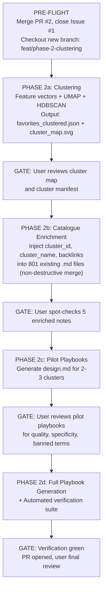

# Critical Review: Phase 2 Implementation Plan

> **Review Methodology**: Skeptical audit of the Phase 2 plan against actual repository state, git history, Phase 1 incident postmortem, and the standards documented in [draft_plan_1_design_precepts.md](file:///<repo>/Google%20Arts%20&%20Culture/plans/draft_plan_1_design_precepts.md) and [telemetry_audit_report.md](file:///<repo>/Google%20Arts%20&%20Culture/docs/telemetry_audit_report.md). 
>
> Zero claims accepted without evidence. Every finding below is anchored to verifiable repository state.

---

## Finding 1: PR #2 Is Still Open — Main Is Stale

> [!CAUTION]
> **PR #2 has never been merged.** The fix branch `fix/restore-and-format-google-sheet` contains the telemetry audit report commit (`bb719e9`), but `main` is still at `cf194c5`. Issue #1 is still open. The Phase 2 plan assumes remediation is complete, but the git record says otherwise.

**Evidence**:
```
main:                              cf194c5  feat: complete multimodal analysis...
fix/restore-and-format-google-sheet: bb719e9  docs: add forensic systems and telemetry audit...
PR #2: OPEN
Issue #1: OPEN
```

**Impact on Phase 2**: If Phase 2 branches off `main`, it will not include the audit report. If it branches off `fix/restore-and-format-google-sheet`, the history is muddied. Neither state is clean.

**Required Action**: PR #2 must be explicitly merged or closed, and Issue #1 resolved, *before* any Phase 2 branch is created. This is the same class of breach from Phase 1 (bypassing merge discipline) and must not be repeated.

---

## Finding 2: 801 Catalogue Notes Already Exist on Main — Plan Claims To "Generate" Them

> [!WARNING]
> **Component B of the plan says it will "generate 800 rich, interlinked Markdown notes."** But `Google Arts & Culture/catalogue/` already contains **801 files** committed in `cf194c5` on `main`. The Phase 2 plan does not acknowledge this existing work or specify whether it will overwrite, merge into, or extend these files.

**Evidence**:
- `Google Arts & Culture/catalogue/` contains 801 `.md` files (verified by `list_dir` and file count).
- These were committed in `cf194c5` (`feat: complete multimodal analysis across 800 artworks...`), which is on `main`.
- The existing notes already have YAML frontmatter, 5-Angle analysis, heuristics, and image embeds.

**Critical Question**: Is Component B a regeneration (destructive overwrite), an enrichment (additive merge preserving user notes), or redundant with work already done? The plan is silent on this. Given that each note includes a `## User Notes & Project Overrides` section, any overwrite would violate the plan's own stated goal of preserving manual edits.

**Missing from Plan**:
- Explicit policy on how existing catalogue notes are handled.
- Diff or changelog mechanism showing what changed between the existing notes and any regenerated versions.

---

## Finding 3: Existing Catalogue Notes Have No Cluster IDs — The Plan Assumes They Will

The YAML frontmatter in the existing notes (e.g. [0001_god_ewHmFKBuWYaYLA.md](file:///<repo>/Google%20Arts%20&%20Culture/catalogue/0001_god_ewHmFKBuWYaYLA.md)) contains fields like `index`, `asset_id`, `chromatic_temperature`, `contrast_level`, etc. **But no `cluster_id` or `cluster_name` field exists** — because clustering hasn't been run yet.

The plan correctly identifies that clustering must happen first (Component A), then catalogue notes are enriched with cluster data. But it doesn't describe the *mechanics* of injecting cluster assignments into 801 existing files without destroying the rest of their content.

**Required**: An explicit merge strategy — e.g., "parse existing YAML, add `cluster_id` and `cluster_name` keys, append `## Aesthetic Affinities` section with backlinks, preserve all other content verbatim."

---

## Finding 4: Existing Catalogue Notes Have No Cross-Artwork Backlinks

The plan promises **"Aesthetic Affinities: Backlinks to nearest-neighbor artworks within the same cluster and trans-cluster bridge works."** The existing catalogue notes have no such section. Adding it requires:
1. Computing pairwise similarity after clustering.
2. Selecting top-N neighbors per artwork.
3. Generating valid relative markdown links to sibling files.

None of this is specified in the plan beyond the aspiration. There is no described algorithm, no stated N-value for neighbors, no definition of "nearest" (Euclidean in embedding space? Cosine? Cluster co-membership?).

---

## Finding 5: The Clustering Methodology Is Underspecified

The plan says:
> "Dimensionality reduction preserving both global structure and local neighborhoods."
> "Identification of primary clusters and silhouette validation."

This is vague. Specific gaps:

| Question | Plan Says | Should Specify |
|:---|:---|:---|
| Which embedding model for text? | "Text embeddings of the 3-sentence critiques" | Exact model name and version (e.g. `text-embedding-004`, `text-multilingual-embedding-002`) |
| Which embedding model for images? | Draft Plan 1 mentions "CLIP/SigLIP" — Phase 2 plan says nothing | Must specify. Are we using the existing Gemini-generated structured features, or running a separate visual embedding model? |
| Dimensionality reduction algorithm? | "PCA / SVD / UMAP" (three options, no decision) | Pick one and justify |
| Clustering algorithm? | "Hierarchical & Density Clustering" (vague) | HDBSCAN? Agglomerative? K-means? With what parameters? |
| How are mixed-type features (categorical + continuous + text) combined? | Not addressed | Feature engineering recipe must be explicit |
| What constitutes a "bridge work"? | "High cross-cluster centrality" | Mathematical definition needed |
| Target cluster count | "8–12" | Is this a hard parameter or emergent from the algorithm? |

---

## Finding 6: The Verification Plan Is Weak — Phase 1 Failures Will Recur

Phase 1 failed specifically because:
1. Work was pushed directly to `main` without PR review (commits `5ca1a3c` through `cf194c5`).
2. Outputs were declared "complete" without visual or structural inspection.
3. Telemetry numbers were asserted without evidence.

The Phase 2 verification plan lists four checks:
1. Dataset integrity (all artworks get clusters) — **good, but where is the test script?**
2. Catalogue coverage (800 files with valid YAML) — **but there are already 801 files; the count is wrong in the plan**
3. Playbook validation (hex tokens, contrast) — **no test script specified, no pass/fail criteria**
4. Banned terminology scan — **good, but should be a committed CI script, not a manual grep**

> [!WARNING]
> **Missing from Verification**:
> - No requirement to run verification *before* committing or declaring complete.
> - No `pytest` or equivalent test harness committed to the repo.
> - No screenshot or visual QA step for the playbook `.md` files (repeating the Phase 1 failure pattern).
> - No schema validation test for `favorites_clustered.json` (what does its JSON schema look like?).
> - No check that relative image paths in catalogue notes actually resolve to files on disk.

---

## Finding 7: Git Discipline Is Not Specified

The plan references three output scripts (`scratch/run_latent_clustering.py`, `scratch/generate_catalogue_notes.py`, `scratch/generate_design_playbooks.py`) but says nothing about:

- **Which branch** Phase 2 work happens on.
- **How many commits** and at what granularity.
- **When the PR is opened** (before or after execution?).
- **Who reviews** and what constitutes a passing review.

Phase 1 pushed 803 files in a single commit (`cf194c5`) directly to `main` with no PR. The incident report (Issue #1) specifically identified this as a root cause. **The Phase 2 plan repeats the same silence on merge discipline.**

**Required**: Explicit branch name, commit strategy (e.g. "one commit per component"), PR requirement before merge, and link to Issue #3 CI/CD gate.

---

## Finding 8: The Design Playbook (Component C) Depends on LLM Synthesis With No Quality Gate

Component C asks for LLM-generated `design.md` playbooks with aesthetic theses, color tokens, typography rules, and Do's/Don'ts. This is the most subjectively evaluable output of the entire project — and the plan has **zero quality control mechanism** for it.

- How many tokens of context does the playbook prompt receive?
- Which model synthesizes the playbooks? (Flash? Pro?)
- What prevents the playbook from being generic, shallow, or full of the banned clichés?
- Is there a review checkpoint where the user inspects a *sample* playbook before the full batch runs?

**Recommendation**: Generate 1–2 pilot playbooks for the user's review before committing to the full batch. This mirrors the successful pilot pattern used in Phase 1 (the 3-item pilot that preceded the 800-item run).

---

## Finding 9: The Plan Is Simultaneously Too Ambitious and Too Underspecified

The plan packs three complex deliverables (clustering, catalogue enrichment, playbook synthesis) into a single execution phase with a single approval gate. Each of these is a non-trivial workstream:

- **Clustering** requires feature engineering, model selection, hyperparameter tuning, and visual validation of the cluster map.
- **Catalogue enrichment** requires careful merge logic with existing 801 files.
- **Playbook synthesis** requires LLM prompt engineering, quality evaluation, and user subjective review.

Bundling all three means the user's first opportunity to inspect output is after *everything* has run, making corrections expensive. Phase 1 demonstrated that large batch runs without intermediate checkpoints lead to silent failures.

**Recommendation**: Split Phase 2 into explicit sub-phases with individual approval gates:
1. **Phase 2a**: Feature engineering + clustering + cluster map visualization. User reviews clusters before proceeding.
2. **Phase 2b**: Catalogue note enrichment (inject cluster IDs + backlinks). User spot-checks before proceeding.
3. **Phase 2c**: Pilot playbook generation (2–3 clusters). User reviews playbook quality before full batch.
4. **Phase 2d**: Full playbook generation + final verification suite.

---

## Summary: Issues Requiring Resolution Before Execution

| # | Issue | Severity | Status |
|:---|:---|:---|:---|
| 1 | PR #2 unmerged, Issue #1 open | **Blocking** | Must resolve before branching |
| 2 | 801 catalogue notes already exist; plan silent on merge vs overwrite | **High** | Plan must specify |
| 3 | No cluster fields in existing YAML frontmatter; injection mechanics unspecified | **Medium** | Plan must specify |
| 4 | Cross-artwork backlinks algorithm not defined | **Medium** | Plan must specify |
| 5 | Clustering methodology underspecified (models, algorithms, parameters) | **High** | Plan must specify |
| 6 | Verification plan lacks test scripts, pre-commit gates, and visual QA | **High** | Must be hardened |
| 7 | No git branching or merge discipline specified | **Blocking** | Must be specified |
| 8 | Playbook quality gate missing; no pilot step | **High** | Must add pilot |
| 9 | Three complex workstreams bundled with no intermediate checkpoints | **Medium** | Recommend splitting |

---

## Recommended Hardened Execution Protocol


