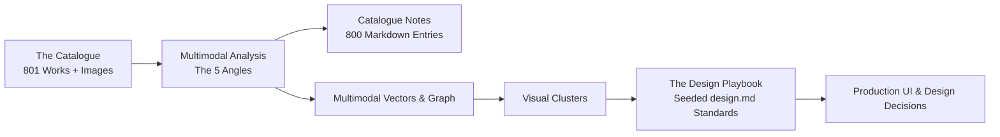

# DRAFT PLAN 1: Design Precepts & Playbook Pipeline
**Document Version**: 1.0.0-final-draft  
**Date**: September 4, 2026  
**Project Workspace**: `<repo>\Google Arts & Culture\`  
**GitHub Repository**: [originallgb/art-to-design](https://github.com/originallgb/art-to-design)  
**Cloud Mirror**: `<drive-mirror>\Google Arts & Culture\`  
**Dataset Reference**: 801 Google Arts & Culture Favorites (Spreadsheet ID: `1Tznbdor6-JFLkGNtuN5StasMSopnLkhdqzgbq7NWdAU`)

---

## 1. Project Purpose & Intent

### Core Intent
The objective is to transform a collection of **801 curated visual favorites** into an **opinionated, amendable Catalogue of Design Precepts & Heuristics**.

Rather than serving as a passive archive, this Catalogue functions as an active visual compass to inform practical decisions in UI/UX development, brand design, spatial architecture, and software systems.

The end deliverable is the **Design Playbook**: a collection of operational **`design.md`** files containing concrete **Standards & Theories** seeded directly from the visual clusters discovered in the Catalogue.



---

## 2. Current Baseline State & Verified Artifacts

The foundational layer is complete, verified, and synchronized across local storage, Google Drive, and GitHub:

1. **The Catalogue Base**:
   - 832 items extracted from the MHTML snapshot; filtered to **801 pure cultural assets** (no Street View tours, 3D interactive experiments, or removed items).
   - Chronological indexing preserved: `index = 1` (oldest favorite) through `index = 801` (newest favorite).
2. **Curatorial Metadata & Enrichment (25+ Fields)**:
   - Primary curatorial fields parsed from Google Arts & Culture payload arrays (`window.INIT_data`).
   - Open data linked from Wikidata (`wdt:P4701`) and Wikimedia Commons (76 matched QIDs, high-res Commons URLs, Wikipedia links).
   - Physical dimensions normalized to metric centimeters ($W \times H \times D$) with estimated scan DPI.
   - Numeric aspect ratios and standard format labels (`3:1`, `4:3`, `16:9`, `1:1`) with categorical orientations (`Panoramic`, `Landscape`, `Square`, `Portrait`).
3. **High-Resolution Visual Assets**:
   - **800 image files** downloaded at max web preview resolution (`=s1200`) and stored in `Google Arts & Culture/images/`.
   - Master scan resolutions tracked from `data_ia` (up to $9847 \times 3238\text{ px}$ for gigapixel scans).
   - Mirrored to Google Drive (`<drive-mirror>\Google Arts & Culture\images\`) and GitHub.
4. **Master Google Sheet**:
   - **[Google Arts & Culture - Favorites](https://docs.google.com/spreadsheets/d/1Tznbdor6-JFLkGNtuN5StasMSopnLkhdqzgbq7NWdAU/edit)**
   - 802 rows × 47 columns with navy header, frozen row, and live `=IMAGE(...)` visual gallery.

---

## 3. The 5 Evaluative Angles

To extract deep, actionable design heuristics and avoid superficial AI descriptions, multimodal vision analysis evaluates each work through **5 distinct Angles**:

| Angle | Analytical Focus | Core Questions Asked of Each Piece |
| :--- | :--- | :--- |
| **1. Composition & Lineage** | Structural geometry & lineage | *What is the underlying compositional grid? How does visual weight flow across the frame? Where does this structure sit in design history?* |
| **2. Utility & Ergonomics** | Functional aesthetics & affordances | *If this piece were an interface, tool, or physical object, what are its affordances? How does it direct viewer focus and hierarchy?* |
| **3. Visual Language & Semiotics** | Symbolism & narrative tension | *What visual signs and symbols carry meaning? What emotional valence or narrative friction is present beyond the literal subject?* |
| **4. Light, Space & Materiality** | Spatial depth & surface texture | *How do light and shadow create space? How is negative space (void vs. mass) handled? What is the tactile quality of the surface?* |
| **5. Color & Typography** | Palette balance & letterforms | *What are the precise hex values, contrast ratios, and color temperatures? If text or calligraphic elements exist, what is their weight and rhythm?* |

---

## 4. Pipeline Architecture

### Phase 1: Multimodal Vision & Analysis
* **Engine**: Asynchronous batch worker using `asyncio` and `httpx` with exponential backoff and rate limiting.
* **Model Tiering**: Gemini 2.5 Flash / 1.5 Flash for bulk 800-image extraction; Pro invoked for cluster synthesis and Playbook standards.
* **Storage**: Local SQLite cache (`scratch/multimodal_analysis.db`) to guarantee idempotency.
* **Structured JSON Schema**:
  ```json
  {
    "visual_composition": {
      "focal_flow": "string",
      "geometric_structure": "string",
      "symmetry_balance": "string",
      "framing_density": "sparse | balanced | dense | claustrophobic"
    },
    "color_and_light": {
      "palette_hex": ["#hex1", "#hex2", "#hex3", "#hex4", "#hex5"],
      "chromatic_temperature": "warm | neutral | cool | mixed",
      "light_source_profile": "diffuse | chiaroscuro | direct | ambient | luminescent",
      "contrast_level": "low | medium | high | extreme"
    },
    "texture_and_materiality": {
      "perceived_surface": "string",
      "material_honesty": "string",
      "spatial_depth_handling": "flat_graphic | layered | deep_perspective | atmospheric"
    },
    "semiotics_and_emotion": {
      "core_symbols": ["string"],
      "emotional_valence": "string",
      "thematic_tensions": ["string"]
    },
    "design_vernacular": {
      "historical_lineage": ["string"],
      "structural_motifs": ["string"],
      "typographic_cues": "string"
    },
    "precept_critique": "Three concise, rigorous sentences identifying why this piece matters to a designer, banning generic art-critical filler.",
    "design_heuristics": ["3-5 actionable design rules or spatial/UI patterns"]
  }
  ```

---

### Phase 2: Latent Clustering & Unexpected Relations
* **Unified Embeddings**: Concatenates textual curatorial vectors with visual embeddings (CLIP/SigLIP).
* **Dimensionality Reduction & Clustering**: Runs UMAP followed by HDBSCAN to discover organic clusters unbounded by medium or time period (e.g. connecting a medieval manuscript with a modernist Swiss poster based on shared high-contrast grid layouts and primary palettes).
* **Bridge Works**: Outliers in HDBSCAN are isolated as "aesthetic bridges" linking different styles.

---

### Phase 3: The Living Catalogue (Obsidian/Logseq Notes)
* **Directory**: `Google Arts & Culture/catalogue/`
* **File Format**: `0801_a-true-and-exact-draught-of-the-tower-liberties_qwFtfThyyZrDcw.md`
* **File Structure**:
  - YAML frontmatter (ID, title, creator, date, cluster, aspect ratio, palette, tags).
  - Embedded local preview image (`![[../images/0801_...jpg]]`).
  - Analysis across the 5 Angles.
  - Actionable design heuristics extracted from the piece.
  - Backlinks to visually related items in the Catalogue.
  - Dedicated User Notes section for manual edits and project tagging.

---

### Phase 4: The Design Playbook (`design.md` Standards)
For each discovered cluster, an operational **`design.md`** file is generated inside `Google Arts & Culture/playbook/`:

#### Anatomy of a `design.md` File:
1. **Title & Aesthetic Thesis**: Clear, descriptive name of the style cluster.
2. **Design Theories**: Core philosophical rationale explaining why this visual system works.
3. **Core Precepts**: 3–5 non-negotiable rules for layout, contrast, and hierarchy.
4. **Color Tokens**: Palette hex codes mapped to functional UI tokens (`bg-primary`, `surface-elevated`, `text-high-contrast`, `accent`).
5. **Typography & Hierarchy**: Scale ratios, serif/sans pairings, and weight rules.
6. **Component Standards**: Specifications for buttons, cards, dividers, borders, and elevation.
7. **Do's & Don'ts**: Concrete guardrails and anti-patterns.
8. **Catalogue Ancestry**: Links to the 5–7 anchor artworks from your collection that seed this standard.

---

## 5. Multi-Lens Critique Prompts Packet

---

### Critique Prompt 1: Intent Understanding & Practical Alignment

```text
PROMPT FOR INTENT UNDERSTANDING CRITIQUE:
You are an expert design strategist reviewing "DRAFT PLAN 1: Design Precepts & Playbook Pipeline".

Evaluate how accurately this plan captures the user's intent:
1. Does the plan successfully turn an archive of 801 Google Arts & Culture favorites into an opinionated, amendable personal Catalogue of design rules?
2. Does the plan treat the collection as a decision-making engine rather than a passive museum archive?
3. Evaluate the derivative deliverable (the seeded `design.md` files). Will the proposed playbook structure give the user practical standards for building real products and interfaces?
4. What practical needs of a working designer might this plan have overlooked?
5. Provide 3 concrete suggestions to sharpen the utility of the output.
```

---

### Critique Prompt 2: Creativity & Analytical Depth

```text
PROMPT FOR CREATIVITY CRITIQUE:
You are a senior design technologist reviewing "DRAFT PLAN 1: Design Precepts & Playbook Pipeline".

Critique the depth and analytical ambition of this architecture:
1. Evaluate the "5 Angles" (Composition & Lineage, Utility & Ergonomics, Visual Language, Light & Space, Color & Typography). Are these angles sharp and orthogonal?
2. How effectively does the plan prevent generic AI observations (banning clichés, enforcing technical rigor)?
3. Critically evaluate the strategy for uncovering unexpected relations across eras. Will the embedding + UMAP approach discover genuine serendipity, or cluster trivially by color and medium?
4. How can the seeded `design.md` playbooks be made more distinctive and opinionated?
```

---

### Critique Prompt 3: Platform, Architecture & Tech Stack

```text
PROMPT FOR TECH STACK CRITIQUE:
You are a Principal Systems Architect reviewing "DRAFT PLAN 1: Design Precepts & Playbook Pipeline".

Critique the technical choices and data flow:
1. Multimodal Vision: Is using Gemini 2.5 Flash / 1.5 Flash for 800-image bulk extraction with Pro for cluster synthesis the optimal cost/quality balance?
2. Catalogue Storage: Is maintaining 800 individual markdown files alongside SQLite caching and TSV/JSON tables resilient and easy to maintain?
3. Clustering Methodology: What are the edge cases of running UMAP + HDBSCAN on concatenated textual and visual embeddings?
4. Data Flow: How well does the local workspace + Google Drive + Google Sheets synchronization hold up over time?
```

---

### Critique Prompt 4: Implementation Rigor & Governance

```text
PROMPT FOR IMPLEMENTATION CRITIQUE:
You are a Senior ML Engineering Lead reviewing "DRAFT PLAN 1: Design Precepts & Playbook Pipeline".

Stress-test the execution mechanics:
1. Rate Limits & Reliability: Does the async batch worker provide sufficient retry logic, backoff, and checkpointing for 800 images?
2. Schema Adherence: What validation ensures 100% compliance with the structured JSON schema without silent failures?
3. User Amendability: When the user manually edits a Catalogue markdown file or adjusts a tag, how does the system preserve those manual overrides during re-runs?
4. Playbook Validation: What automated checks verify that a generated `design.md` contains valid hex tokens, accessible contrast ratios, and working file references?
```

---

## 6. Artifact Commitment Record

* **Primary Plan Path**: `Google Arts & Culture/plans/draft_plan_1_design_precepts.md`
* **Google Drive Mirror**: `<drive-mirror>/Google Arts & Culture/plans/draft_plan_1_design_precepts.md`
* **GitHub**: [originallgb/art-to-design](https://github.com/originallgb/art-to-design)
* **Status**: Final Draft 1 (Ready for prototype execution).
