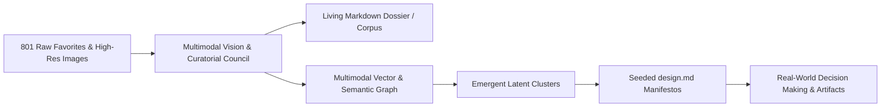
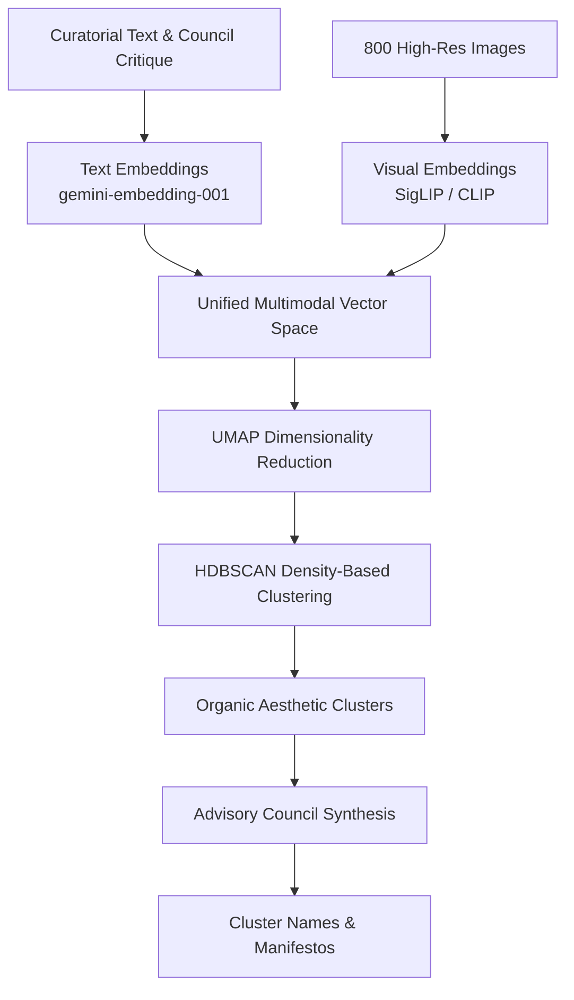
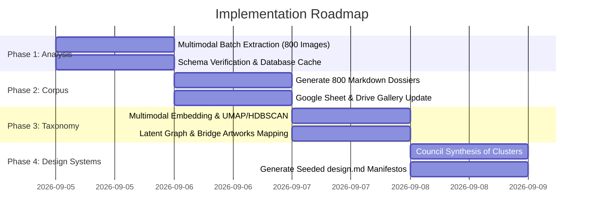

# DRAFT PLAN 1: Personal Taste Genome & Generative Design System Pipeline
**Document Version**: 1.0.0-draft  
**Date**: September 4, 2026  
**Project Workspace**: `<repo>\Google Arts & Culture\`  
**Cloud Mirror**: `<drive-mirror>\Google Arts & Culture\`  
**Dataset Reference**: 801 Google Arts & Culture Favorites (Spreadsheet ID: `1Tznbdor6-JFLkGNtuN5StasMSopnLkhdqzgbq7NWdAU`)

---

## 1. Executive Summary & Intent Understanding

### Core Project Intent
The objective is to transform an existing collection of **801 curated visual favorites** into an **opinionated, amendable, and queryable "Personal Taste Genome"**. 

Rather than serving merely as a static archive or catalog, this corpus is designed to function as an active **aesthetic and conceptual compass** that informs real-world decisions in software design, visual architecture, brand identity, physical spaces, and creative technology.

The primary derivative work produced from this genome will be a suite of **`design.md`** files: operational design systems and philosophical manifestos seeded directly from the emergent curatorial clusters discovered within the corpus.



---

## 2. Current Baseline State & Verified Artifacts

Before initiating this phase, the following foundation has been completely established, verified, and synchronized:

1. **Source Data & Asset Purification**:
   - 832 items extracted from the MHTML snapshot; filtered down to **801 pure cultural assets** (excluding Street View panoramas, interactive 3D experiments, and removed items).
   - Chronological indexing strictly preserved: `index = 1` represents the oldest favorite, up to `index = 801` as the newest favorite.
2. **Deep Curatorial Metadata Enrichment (25+ Fields)**:
   - Primary curatorial metadata parsed from Google Arts & Culture internal payloads (`window.INIT_data`).
   - Open data linked from Wikidata (`wdt:P4701`) and Wikimedia Commons (76 matched QIDs, high-res Commons URLs, Wikipedia links).
   - Physical dimensions parsed and normalized to metric centimeters ($W \times H \times D$) with estimated scan DPI.
   - Exact floating-point aspect ratios and standard photographic/art ratio classifications (`"3:1"`, `"4:3"`, `"16:9"`, etc.) alongside categorical orientations (`Panoramic`, `Landscape`, `Square`, `Portrait`).
3. **High-Resolution Visual Assets**:
   - **800 image files** downloaded at max web preview resolution (`=s1200`) and stored locally in `Google Arts & Culture/images/`.
   - Master scan pixel resolutions preserved from `data_ia` (e.g. $9847 \times 3238\text{ px}$ for gigapixel canvases).
   - Mirrored to Google Drive for Desktop (`<drive-mirror>\Google Arts & Culture\images\`) and Google Drive cloud folder (`REDACTED_DRIVE_FOLDER_ID`).
4. **Master Google Sheet**:
   - **[Google Arts & Culture - Favorites](https://docs.google.com/spreadsheets/d/1Tznbdor6-JFLkGNtuN5StasMSopnLkhdqzgbq7NWdAU/edit)**
   - 802 rows $\times$ 47 columns ($37,694$ cells) styled with navy blue header, frozen row, and live `=IMAGE(...)` preview gallery.

---

## 3. The Advisory Council Framework ("The Board Members")

To ensure the multimodal vision analysis escapes superficial AI art criticism (clichés like *"a stunning study in contrasts"* or *"captivating brushwork"*), all analytical passes are filtered through **5 complementary intellectual and aesthetic personas**:

| Board Member | Intellectual Discipline | Analytical Focus & Questions |
| :--- | :--- | :--- |
| **1. The Formalist** | Master Curator & Art Historian | *Lineage, composition, technique, rhythm, structural balance, and art-historical provenance.* Where does this piece sit in visual evolution? What compositional geometry anchors the frame? |
| **2. The Industrial & UX Designer** | Principal Product Designer | *Affordances, functional aesthetics, spatial ergonomics, surface tension, and visual hierarchy.* If this artwork were an operating system or physical tool, how would it behave? |
| **3. The Cultural Semiotician** | Visual Anthropologist | *Symbolic encoding, emotional valence, cultural myths, and narrative subtext.* What is this image communicating beyond its literal depiction? What latent tensions exist? |
| **4. The Spatial Materialist** | Architectural Theorist | *Light, shadow, negative space, tactile materiality, surface texture, and physical depth.* How does this piece handle void versus mass? How does light construct space? |
| **5. The Colorist & Typographer** | Visual Systems Analyst | *Chromatic harmonies, tonal contrast profiles, luminance gradients, and typographic weight.* What is the exact color balance and psychological temperature of the palette? |

---

## 4. End-to-End System Architecture

### Phase 1: Multimodal Vision & Curatorial Extraction
* **Execution Engine**: Asynchronous batch worker using `asyncio` and `httpx` with exponential backoff and rate-limiting.
* **Model Selection**: Gemini 2.5 Flash / 1.5 Flash for bulk 800-image extraction (cost-effective, high visual acuity), with Pro invoked for synthesis and cluster manifestos.
* **Caching & Idempotency**: Local SQLite database (`scratch/multimodal_analysis.db`) to guarantee zero duplicate API calls.
* **Strict JSON Schema**:
  ```json
  {
    "visual_composition": {
      "focal_flow": "string",
      "geometric_structure": "string",
      "symmetry_balance": "string",
      "framing_density": "sparse | balanced | dense | claustrophobic"
    },
    "color_and_light": {
      "palette_hex": ["#hex1", "#hex2", "#hex3", "#hex4", "#hex5"],
      "chromatic_temperature": "warm | neutral | cool | mixed",
      "light_source_profile": "diffuse | chiaroscuro | direct | ambient | luminescent",
      "contrast_level": "low | medium | high | extreme"
    },
    "texture_and_materiality": {
      "perceived_surface": "string",
      "material_honesty": "string",
      "spatial_depth_handling": "flat_graphic | layered | deep_perspective | atmospheric"
    },
    "semiotics_and_emotion": {
      "core_symbols": ["string"],
      "emotional_valence": "string",
      "thematic_tensions": ["string"]
    },
    "design_vernacular": {
      "historical_lineage": ["string"],
      "structural_motifs": ["string"],
      "typographic_calligraphic_cues": "string"
    },
    "council_critique": "Three rigorous sentences synthesizing why this piece matters to a designer, strictly avoiding banned clichés.",
    "design_affordances": ["3-5 concrete design primitives or UI/spatial ideas"]
  }
  ```

---

### Phase 2: Emergent Taxonomy, Clustering & Latent Graph

To uncover non-obvious, cross-era aesthetic connections (e.g. a 14th-century Japanese woodblock echoing 1960s Braun industrial packaging), we utilize a multi-modal embedding and graph pipeline:



* **Serendipity & Bridge Artworks**:
  - Outliers in HDBSCAN are specifically examined as **"aesthetic bridges"** that connect seemingly disparate movements.
  - Generates a persistent graph (`taste_knowledge_graph.json`) where nodes are artworks and edges represent shared chromatic moods, spatial handling, or semiotic resonances.

---

### Phase 3: The Living "Taste Genome" (Obsidian/Logseq Dossier)

Rather than burying insights in a database, the corpus is realized as an amendable, local Markdown knowledge base:
* **Directory**: `Google Arts & Culture/corpus/`
* **File Naming**: `0801_a-true-and-exact-draught-of-the-tower-liberties_qwFtfThyyZrDcw.md`
* **File Anatomy**:
  - **YAML Frontmatter**: Machine-readable metadata (index, title, creator, date, cluster, aspect ratio, palette, tags).
  - **Embedded Visual Asset**: `![[../images/0801_...jpg]]`
  - **Curatorial Council Critique**: The 5-member board analysis.
  - **Design Affordances**: Extracted UI/UX/architectural primitives.
  - **Backlinks & Aesthetic Neighbors**: Links to visually or conceptually related artworks in the corpus.
  - **User Notes Section**: Reserved space for personal annotations, project references, and override tags.

---

### Phase 4: Derivative Output — Seeded `design.md` Manifestos

For each discovered cluster (e.g. *Cluster 01: "Neo-Sacred Minimalism"*, *Cluster 02: "Industrial Brutalism & Technical Lineage"*), an operational `design.md` file is generated:

#### Structure of a Seeded `design.md`:
1. **Title & Aesthetic Nomenclature**: Evocative, precise design ethos.
2. **Philosophy**: Core philosophical manifesto justifying this visual language.
3. **Visual Principles**: 3–5 non-negotiable design heuristics (e.g., *"Honor negative space as a primary architectural material; reject ornamental framing"*).
4. **Color Design Tokens**: Exact hex values mapped to semantic roles (`bg-primary`, `surface-elevated`, `text-high-contrast`, `accent-vital`).
5. **Typography & Hierarchy Guidelines**: Contrast ratios, serif/sans relationships, scale ratios, and letterform characteristics.
6. **Layout & Spatial Rules**: Grid strictness, padding rhythms, border radii, depth/elevation philosophy.
7. **Component Primitives & Patterns**: Button styles, card affordances, dividers, navigation behaviors.
8. **Do's and Don'ts Table**: Explicit anti-patterns versus desired executions.
9. **Ancestral Lineage**: Deep links to the 5–7 artworks from your corpus that anchor this design system.

---

## 5. Implementation Roadmap



---

## 6. Multi-Lens Critique Prompts Packet

The following four prompts are designed to allow external reasoning models, peer agents, or human reviewers to rigorously stress-test this plan across its four critical dimensions:

---

### Critique Prompt 1: Intent Understanding & Intellectual Alignment

```text
PROMPT FOR INTENT UNDERSTANDING CRITIQUE:
You are an expert design strategist and intellectual auditor reviewing "DRAFT PLAN 1: Personal Taste Genome & Generative Design System Pipeline".

Evaluate how deeply and accurately this plan captures the user's ultimate intent:
1. Does the plan successfully bridge the gap between an archive of 801 Google Arts & Culture favorites and an "opinionated and amendable personal art/style/design corpus"?
2. Does the plan treat the collection as a living decision-support engine rather than a passive gallery? Where might it risk becoming mere cataloging?
3. Evaluate the derivative deliverable (the seeded `design.md` files). Will the proposed structure actually empower the user to make tangible software, visual, and architectural design decisions?
4. What implicit desires or higher-order goals of the user might this plan have overlooked or under-emphasized?
5. Provide 3 concrete recommendations to strengthen the conceptual and practical alignment with the user's taste.
```

---

### Critique Prompt 2: Creativity, Aesthetic Ambition & Novelty

```text
PROMPT FOR CREATIVITY & NOVELTY CRITIQUE:
You are an avant-garde design theorist, museum director, and creative technologist reviewing "DRAFT PLAN 1: Personal Taste Genome".

Critique the aesthetic and creative ambition of this architecture:
1. Evaluate the "Advisory Board Personas" (The Formalist, The Industrial & UX Designer, The Cultural Semiotician, The Spatial Materialist, The Colorist & Typographer). Are these lenses sufficiently bold, orthogonal, and insightful? Are there crucial aesthetic perspectives missing (e.g., The Algorithmic Generativist, The Ecological/Vernacularist, The Subversive Post-Modernist)?
2. How effective is the plan at escaping the "generic AI aesthetic trap" (superficial praise, generic color summaries, predictable clichés)?
3. Critically evaluate the strategy for discovering "unexpected relations" across eras and mediums. Does the proposed embedding + UMAP + graph approach foster genuine serendipity, or will it cluster predictably by superficial visual traits?
4. How can the generation of the seeded `design.md` manifestos be made more provocative, distinctive, and intellectually daring?
```

---

### Critique Prompt 3: Platform, Architecture & Tech Stack Evaluation

```text
PROMPT FOR PLATFORM & TECH STACK CRITIQUE:
You are a Principal AI Systems Architect and Data Engineer reviewing the technical stack of "DRAFT PLAN 1: Personal Taste Genome".

Critique the technology selections, data topologies, and architectural trade-offs:
1. Multimodal Vision Pipeline: Evaluate using Gemini 2.5 Flash / 1.5 Flash for the 800-image bulk extraction with Pro reserved for cluster synthesis. Is this the optimal cost/quality/latency boundary?
2. Local Markdown Dossier (Obsidian/Logseq format) vs. Database-Centric Storage: Is maintaining 800 individual markdown files with YAML frontmatter alongside SQLite and Parquet embeddings resilient, performant, and maintainable?
3. Unsupervised Clustering Methodology: Evaluate UMAP + HDBSCAN on concatenated textual and visual embeddings. What pitfalls exist (e.g., high-dimensional distortion, hyperparameter sensitivity, cluster fragmentation)? Should alternative semantic graph or topic modeling approaches (e.g., BERTopic, Leiden community detection) be considered?
4. Cloud & Desktop Sync Architecture: How well does the dual-write setup (Local Workspace + Google Drive for Desktop + Native Google Sheet) handle synchronization, latency, and consistency?
```

---

### Critique Prompt 4: Implementation Rigor, Scalability & Guardrails

```text
PROMPT FOR IMPLEMENTATION & EXECUTION CRITIQUE:
You are a Senior ML Engineering Lead and Site Reliability Architect reviewing the execution plan of "DRAFT PLAN 1: Personal Taste Genome".

Rigorously stress-test the execution mechanics and risk mitigations:
1. Rate Limiting & Resilience: 800 parallel multimodal LLM requests with large image payloads can trigger rate limits (429s), timeouts, or partial failures. Does the plan provide adequate batching, backoff, and stateful checkpointing?
2. Schema Adherence: LLMs occasionally hallucinate keys or return malformed JSON when processing complex multimodal prompts. What strict validation and automatic retry mechanisms should be enforced?
3. Human-in-the-Loop & Amendability: The user specifically required an "amendable" corpus. How does the system handle manual user edits in the Markdown files or Google Sheet without losing changes during subsequent automated re-runs?
4. Measurable Success Criteria: What automated and qualitative metrics should determine whether a generated `design.md` is genuinely operational and true to the user's taste?
```

---

## 7. Artifact Commitment Record

* **Primary Artifact Path**: `Google Arts & Culture\plans\draft_plan_1_personal_taste_genome.md`
* **Google Drive Sync Path**: `<drive-mirror>\Google Arts & Culture\plans\draft_plan_1_personal_taste_genome.md`
* **Agent Brain Artifact**: `<appDataDir>\brain\agy-session-2287\draft_plan_1_personal_taste_genome.md`
* **Status**: Committed Draft 1 (Awaiting multi-lens critique review).
