# Phase 2 Implementation Plan: Latent Clustering, Catalogue Notes & Design Playbook

> **Strategic Governance Principle**:  
> **Pragmatic Risk Mitigation**: We enforce rigorous local invariants, non-destructive additive merges, and progressive review gates *without* getting prematurely trapped in complex operational hardening. Extensive CI/CD workflow buildouts remain isolated in the lane assigned to `@jules` (Issue #3). Our execution focuses on data safety, empirical validation, and actionable design deliverables.

---

## 1. Upstream Invariant: The Non-Destructive Rule

> [!CAUTION]
> ### **CARDINAL RULE: NON-DESTRUCTIVE ADDITIVE ENRICHMENT**
> **No script, tool, or autonomous agent may destructively overwrite or mutate extant project artifacts without verifiable supporting evidence, automated backup, and explicit review approval.**
> 
> * Upstream datasets (`favorites.json`, `favorites_enriched.json`, `favorites_analyzed.json`) are immutable baselines.
> * The existing 801 Catalogue Notes (`Google Arts & Culture/catalogue/*.md`) already committed to `main` must be **additively enriched**—their existing analyses, heuristics, and user overrides (`## User Notes & Project Overrides`) must be preserved 100% verbatim.
> * Master Google Sheet tabs (`Enriched Favorites`, `Catalogue Precepts`) must never be modified in-place; any new views must be created on a dedicated, fresh tab.

---

## 2. Phase 2 Gated Execution Pipeline

Phase 2 is divided into four sequential sub-phases with explicit checkpoints to prevent unverified bulk failures:

```mermaid
flowchart TD
    Main["main branch (PR #2 merged, Issue #1 closed)"] --> Branch["git checkout -b feat/phase-2-clustering-and-playbooks"]
    
    Branch --> P2A["PHASE 2a: Latent Clustering & ADR<br/>- Feature engineering (CIELAB, spatial, semantics, precepts)<br/>- Clustering research & ADR 001<br/>- favorites_clustered.json + cluster_map.svg"]
    P2A --> GateA{"GATE 2a: User Review<br/>Inspect cluster manifest, silhouette metrics,<br/>and 2D cluster coordinate map"}
    
    GateA -->|Approved| P2B["PHASE 2b: Catalogue Notes Non-Destructive Enrichment<br/>- Add cluster_id and cluster_name to YAML<br/>- Append ## Aesthetic Affinities (intra-cluster neighbors)<br/>- 100% preservation of critique & user overrides"]
    P2B --> GateB{"GATE 2b: User Review<br/>Spot-check 5 enriched notes + diff report"}
    
    GateB -->|Approved| P2C["PHASE 2c: Pilot Playbook Generation<br/>- Synthesize design.md for 2-3 diverse clusters<br/>- Evaluated against 3-item pilot evidence pattern"]
    P2C --> GateC{"GATE 2c: User Review<br/>Evaluate pilot playbooks for design utility,<br/>token semantics, and zero banned clichés"}
    
    GateC -->|Approved| P2D["PHASE 2d: Full Playbook Generation & Local QA<br/>- Generate remaining playbooks<br/>- Execute local automated test suite<br/>- Open Pull Request against main"]
    P2D --> FinalGate{"FINAL GATE<br/>PR Review & Merge"}
```

---

## 3. Sub-Phase Specifications

### Phase 2a: Feature Engineering, Clustering Research & ADR
* **Upstream Rule Check**: Generates `Google Arts & Culture/favorites_clustered.json` additively. Does NOT touch `favorites_analyzed.json`.
* **Architecture Decision Record (ADR)**:
  - Author `Google Arts & Culture/docs/adr_001_latent_clustering_methodology.md`.
  - Evaluate multimodal feature spaces:
    1. Perceptual color metrics (5 palette hexes mapped to CIELAB $L^*, a^*, b^*$, chromatic temperature, contrast ratio).
    2. Spatial/compositional tags (framing density, spatial depth, aspect ratio).
    3. Visual vernacular & historical lineage tokens.
    4. Semantic embeddings of design precepts and heuristics.
  - Evaluate dimensionality reduction and clustering models (e.g. UMAP / TruncatedSVD with HDBSCAN / Hierarchical Ward / K-Means) targeting **8 to 12 coherent aesthetic clusters**.
  - Document silhouette scores, cluster size distributions, and linked empirical proof.
* **Outputs**:
  - `Google Arts & Culture/favorites_clustered.json` & `.tsv`
  - `Google Arts & Culture/docs/cluster_manifest.json` (cluster names, aesthetic philosophies, anchor works)
  - `Google Arts & Culture/docs/latent_cluster_map.svg` (2D coordinate visual map)
* **Gate 2a Review**: Present cluster manifest and visual map to user for validation before modifying any catalogue notes.

---

### Phase 2b: Catalogue Notes Non-Destructive Enrichment
* **Upstream Rule Check**: The existing 801 `.md` files in `Google Arts & Culture/catalogue/` represent valuable intellectual property. Overwriting them is strictly forbidden.
* **Explicit Additive Merge Strategy**:
  1. For each of the 801 existing `.md` files:
     - Parse YAML frontmatter between `---` boundaries and Markdown body.
     - Inject `cluster_id: <int>` and `cluster_name: "<str>"` into frontmatter.
     - Preserve all other frontmatter fields unchanged.
  2. Compute intra-cluster affinities (top-3 nearest neighbor artworks within the same cluster based on latent centroid distance).
  3. Insert `## Aesthetic Affinities` section immediately preceding `## User Notes & Project Overrides`.
  4. Ensure `## User Notes & Project Overrides` and any user annotations are preserved verbatim.
  5. Run an automated non-destructive diff check asserting that 100% of existing critique text, heuristics, and user notes remain identical.
* **Gate 2b Review**: User spot-checks 5 enriched notes and reviews the non-destructive diff report.

---

### Phase 2c: Pilot Playbook Generation (2–3 Clusters)
* **Empirical Evidence Pattern**: Anchored in the successful 3-item pilot methodology from Phase 1 (which verified schema conformance and cost math before the 800-item run).
* **Execution**:
  - Select 2–3 stylistically diverse clusters from Phase 2a (e.g. *High-Contrast Geometric Constructivism*, *Atmospheric Chiaroscuro & Layered Depth*, *Minimalist Calligraphic Architecture*).
  - Generate `design.md` inside `Google Arts & Culture/playbook/[cluster_slug]/design.md`.
  - Structure per playbook:
    1. **Aesthetic Thesis & Design Theories**: Philosophical rationale and architectural lineage.
    2. **Core Precepts**: 3–5 non-negotiable rules for layout, visual weight, and contrast.
    3. **Color Tokens**: Semantic UI tokens (`color-bg-base`, `color-surface-elevated`, `color-text-primary`, `color-accent-tension`, `color-border-subtle`).
    4. **Typography & Layout Hierarchy**: Type scale ratios, line-height rhythms, grid systems.
    5. **Component Specifications & Affordances**: Guidance on buttons, cards, containers, elevation, and negative space.
    6. **Do's & Don'ts**: Concrete guardrails and anti-patterns.
    7. **Catalogue Ancestry**: 5–8 anchor works from the collection seeding this standard with relative links.
* **Gate 2c Review**: User reviews pilot playbooks for depth, actionable design utility, token validity, and zero usage of banned vocabulary ("Genome", "Living", and generic art clichés).

---

### Phase 2d: Full Playbook Generation & Local Automated Test Suite
* **Execution**: Synthesize remaining `design.md` playbooks across all clusters.
* **Pragmatic Local Verification Suite (`scratch/test_phase2_integrity.py`)**:
  1. **Schema & Count Test**: Assert all 801 items exist in `favorites_clustered.json` with valid `cluster_id` and non-null attributes.
  2. **Catalogue File Test**: Assert exactly 801 files exist in `Google Arts & Culture/catalogue/`, each with valid YAML frontmatter containing `cluster_id`. *(Historical note: the repo was later flattened and `catalogue/` now sits at the repo root.)*
  3. **Path Resolution Test**: Assert that all relative image links (``) point to actual files existing on disk. *(Historical note: the images were later dropped for copyright reasons; catalogue notes now link out to the Google Arts & Culture source instead.)*
  4. **Playbook Token Test**: Assert all `design.md` playbooks contain valid hex color codes and required markdown headings.
  5. **Banned Terminology Test**: Automated regex scan across all generated files asserting zero occurrences of "Genome", "Living", or banned art-historical clichés.
* **Git Delivery**: Commit atomic sub-phase changes to branch `feat/phase-2-clustering-and-playbooks` and open a Pull Request against `main`.

---

## 4. Backlog Candidates (Deferred to Avoid Premature Hardening)

To prevent getting bogged down in operational over-hardening during initial exploration, the following advanced capabilities are logged to the project backlog:

| Backlog Item | Description | Dependency |
| :--- | :--- | :--- |
| **Trans-Cluster Graph Backlinks** | Deep cross-cluster graph traversal to discover trans-historical "bridge works" linking disparate eras (e.g. medieval manuscript grids to modernist poster layout). | Post-clustering evaluation & empirical graph distance metrics |
| **Vector Database Indexing** | Exporting latent vectors to an embedded vector store (e.g. LanceDB / Chroma) for real-time natural language semantic querying. | Finalized embedding feature space |
| **Automated WCAG Contrast Linter** | GitHub Action checking contrast ratios between generated `color-bg-*` and `color-text-*` tokens against WCAG AAA standards. | Operational playbooks merged to `main` |
| **Interactive Latent Explorer** | Lightweight web-based visualizer for exploring the 2D/3D latent manifold and cluster boundaries in the browser. | Cluster coordinates generated |

---

## 5. Verification & Review Checkpoints

| Checkpoint | Scope | Criteria for Pass |
| :--- | :--- | :--- |
| **Pre-Flight** | Clean `main` branch | PR #2 merged, Issue #1 closed, `main` fast-forwarded (Done) |
| **Gate 2a** | Clustering & ADR | ADR 001 published, 8–12 clusters validated, cluster map generated |
| **Gate 2b** | Catalogue Enrichment | 801 notes updated with cluster metadata, 0% loss of existing text |
| **Gate 2c** | Pilot Playbooks | 2–3 pilot `design.md` approved for design rigor and utility |
| **Gate 2d / Final** | Full Playbook & QA | Automated test suite passes 100%, PR opened against `main` |
